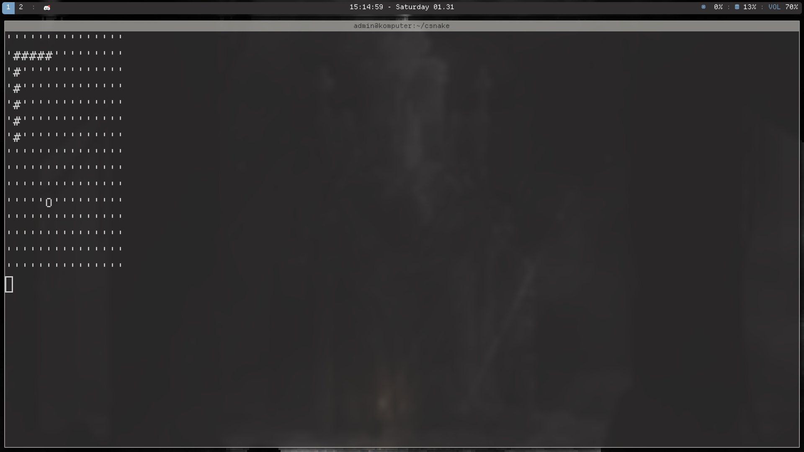

# Snake Terminal Game



game uses termios struct and linux syscall so it won't work on Windows

## Keybinds

+ Movement - WASD
+ Grow     - g
+ Restart  - r
+ Quit     - q

## Build
build is simple 
```
$ gcc -o csnake main.c && ./csnake
```

